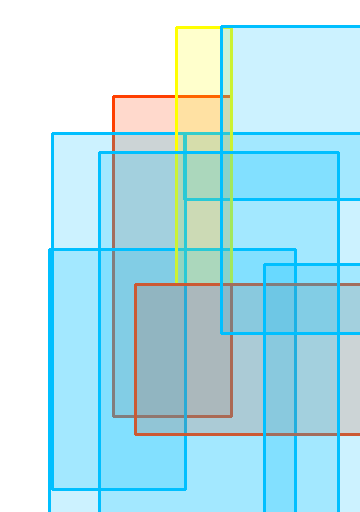
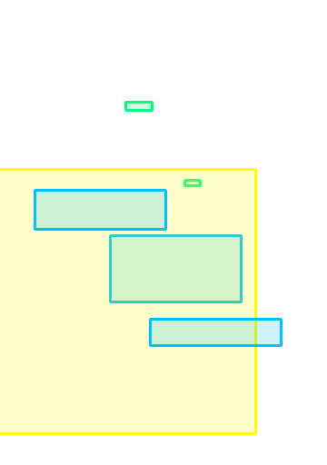

# <p style="text-align: center;">[ICCV 23] DLT: Conditioned layout generation with Joint Discrete-Continuous Diffusion Layout Transformer</p>

This repository is an official implementation of DLT paper. Please, refer to the [paper](https://arxiv.org/abs/2110.00000) 
for more details and [project page](https://wix-incubator.github.io/DLT/) for general overview.<div style="display: flex; flex-direction: column; align-items: center;">

| Unconditional                              | Category                          | Category + Size                       |
|--------------------------------------------|-----------------------------------|---------------------------------------|
|  |  |  |


### Dev environment
- Operating System: Ubuntu 18.04
- CUDA Version: 11.6
- Python Version: 3.9
### Requirements
All relevant requirements are listed in [environment.yml](environment.yml). We recommend using 
[conda](https://docs.conda.io/en/latest/) to create the appropriate environment and install the dependencies:
```bash
conda env create -f environment.yml
conda activate dlt
```
### Datasets
Please download the public datasets at the following webpages. Put it in your folder and update 
`./dlt/configs/remote/dataset_config.yaml` accordingly.

1. [RICO](https://interactionmining.org/rico)
2. [PubLayNet](https://github.com/ibm-aur-nlp/PubLayNet)
3. [Magazine](https://xtqiao.com/projects/content_aware_layout/)

### Training
You can train the model using any config script in [configs](./dlt/configs) folder. For example, if you want to train the 
provided DLT model on publaynet dataset, the command is as follows:

```bash
cd dlt
python main.py --config configs/remote/dlt_publaynet_config.yaml --workdir <WORKDIR>
```
Please, see that code is accelerator agnostic. if you don't want to log results to wandb, just set `--workdir test` 
in args.

### Evaluation

To generate samples for evaluation on the test set, follow these steps:

- train the model using the above command
- Run the following command:

```bash
# put weights in config.logs folder
DATASET = "publaynet" # or "rico" or "magazine"
python generate_samples.py --config configs/remote/dlt_{$DATASET}_config.yaml \\
                           --workdir <WORKDIR> --epoch <EPOCH> --cond_type <COND_TYPE> \\
                           --save True
# get all the metrics 
# update path to pickle file in dlt/evaluation/metric_comp.py
./download_fid_model.sh
python metric_comp.py
```
where `<COND_TYPE>` can be: (all, whole_box, loc) - (unconditional, category, category+size) respectively,
`<EPOCH>` is the epoch number of the model you want to evaluate, and `<WORKDIR>` is the path to the folder where
the model weights are saved (e.g. rico_final). The generated samples will be saved in `logs/<WORKDIR>/samples` folder if `save` True.

An output from it is pickle file with generated samples. You can use it to calculate metrics.

The folder with weights after training has this structure:
```
logs
├── magazine_final
│   ├── checkpoints
│   └── samples
├── publaynet_final
│   ├── checkpoints
│   └── samples
└── rico_final
    ├── checkpoints
    └── samples
```

## Citation

If you find this code useful for your research, please cite our paper:

```
@misc{levi2023dlt,
      title={DLT: Conditioned layout generation with Joint Discrete-Continuous Diffusion Layout Transformer},
      author={Elad Levi and Eli Brosh and Mykola Mykhailych and Meir Perez},
      year={2023},
      eprint={2303.03755},
      archivePrefix={arXiv},
      primaryClass={cs.CV}
}
```